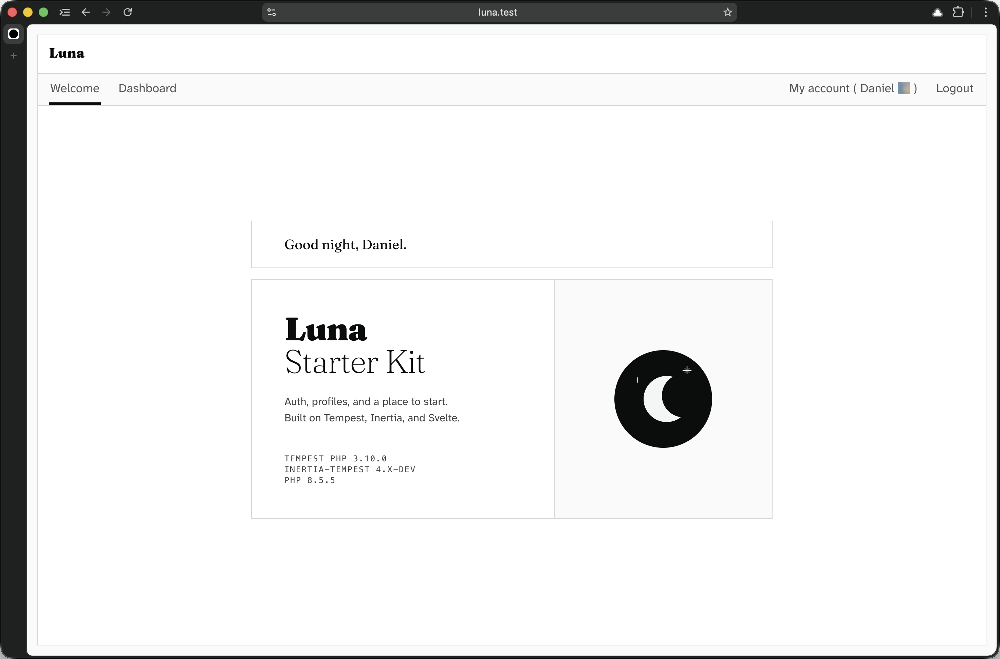

# *Luna*
A starter kit for [Tempest PHP](https://tempestphp.com) using Inertia and Svelte.

---

> [!WARNING]
> This project is not production-ready (Tempest is not yet stable), but you can use it as a starting point for your own projects.

> [!INFO]
> This is a work in progress.

---



---

## Stack

| Layer     | Technology                                                                   |
|-----------|------------------------------------------------------------------------------|
| Framework | [Tempest PHP](https://tempestphp.com) 3.x+                                   |
| Bridge    | [inertia-tempest](https://github.com/Maarten-Dekker/inertia-tempest) 4.x-dev |
| Frontend  | [Svelte 5](https://svelte.dev) + [Inertia.js](https://inertiajs.com)         |
| Language  | PHP 8.5+                                                                     |
| Build     | Vite + Tailwind CSS v4 + vite-plugin-tempest                                 |
| Database  | PostgreSQL                                                                   |

---

## Included

- **Welcome Page**
- **Authentication**
  - Create an account
  - Sign in
  - Reset password via email
  - Remember me
- **Session management**
  - custom database-backed session manager with encrypted payload, IP address and user agent tracking
- **Middleware**
  - `MustBeAuthenticated`
  - `RedirectIfAuthenticated`
- **Validation**
  - custom `Unique` rule
- **View layouts**
  - `Base`
  - `App`
  - `Auth`
- **Routes**
  - lightweight `uri()` helper inspired by Ziggy.
    - Builds type-safe URLs from a Tempest route manifest with param substitution, query string support and `uriIs()` for active path matching
---

## Requirements

- PHP 8.5+
- Composer
- PostgreSQL
- Node.js + Bun (or npm)

---

## Getting started

```bash
git clone https://github.com/dcmxyz/tempest-luna my-project

cd my-project

cp .env.example .env
```

```bash
composer install

bun install
```

```bash
php tempest key:generate

php tempest migrate:up
```

```bash
bun run dev
# or
npm run dev
```

---

## Notes

- No database-level foreign key constraints, relationships are managed in application code
- The route manifest (`.tempest/typescript/routes.ts`) is auto-generated on dev start and on every controller file change via the `tempestRoutes` Vite plugin